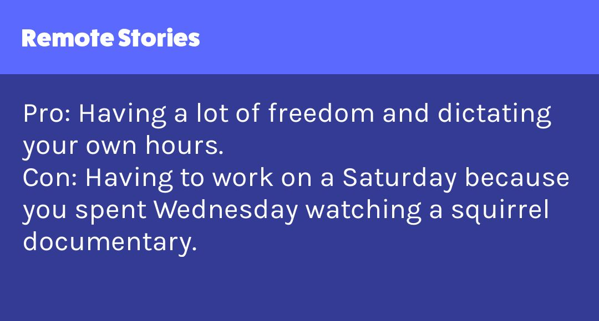

# HTML/CSS to Image API

## Quick start

Welcome to the API docs! To get started, we recommend taking a look at one of our code samples. 

Don't want to write code? That's OK! We also integrate with [Zapier](getting-started/zapier-integration.md) and [Integromat](getting-started/integromat-integration.md).





















Your favorite language not here? Sorry about that! Don't worry, we work with any language or framework. See the [curl](example-code/curl.md) example for how to make a request. [Email us](mailto:support@htmlcsstoimage.com) if you need help getting started. We'd love to add more example code here.

## Image Examples

Your imagination is the only limit. We render HTML/CSS just like Google Chrome. Here are a few examples of ways people have used the API to automate their image generation.

### Social Images: Dev.to

[Dev.to](https://dev.to) uses the API to autogenerate thousands of custom images for Twitter and Facebook.

To see how they do it, [take a look at their code](https://github.com/thepracticaldev/dev.to/blob/master/app/controllers/social_previews_controller.rb) \(it's open source!\).

### Product Hunt Makers Social Cards

Product Hunt uses HTML/CSS to Image to dynamically generate social cards for Maker Goals.

Source code for this example on [CodePen](https://codepen.io/ayrtonbe/pen/ZmWBMw).

### Remote Stories Social Cards

Source code for this example on [CodePen](https://codepen.io/ayrtonbe/pen/pQLyKN).

### Highlighted Text Shots

Generate images from your users comments. Add the ability to highlight and share.

Source code for this example on [CodePen](https://codepen.io/mscccc/pen/yRzBWP).

### Auto Generated Job Listing

Generate images from job listings for sharing in emails, ads or social media.

Source code for this example on [CodePen](https://codepen.io/mscccc/pen/xyXKrj).

### Full Webpage Screenshots

We call this [URL to image](getting-started/url-to-image.md). You can pass in a URL, and we'll generate a screenshot of the webpage.

Here is an example of [stripe.com](https://stripe.com)'s homepage rendered using the API.

### Resize on the fly

Once an image is generated, use our API to adjust the image to any size you need with the **width** and **height** params. When only one param is passed, the API will maintain the aspect ratio of the original image.

**?width=400**

**?width=400&height=400**

**?height=300**

## Get an API key

To use this API, you'll first need an API key. You may retrieve one by [signing up here](https://htmlcsstoimage.com).

## Start creating images from HTML/CSS

Now that you have an API key, get started [creating your first image](getting-started/creating-an-image.md).



