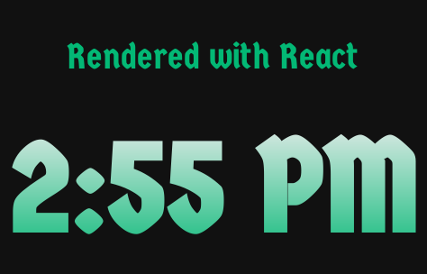

# Rendering a React component

Here we will generate an image from a React Clock component.

```javascript
<div>
  <p>Rendered with React</p>
  <h1>
    <Clock format="LT" ticking={true} interval={1000} />
  </h1>
</div>
```


### **Load event**

The API waits for the browser to send a [load](https://developer.mozilla.org/en-US/docs/Web/API/Window/load_event) event before taking a screenshot. As long as everything on the page is rendered at that point, it will be included in the image.


### Image

Here's the end result.



### HTML



```markup
<link href="https://fonts.googleapis.com/css?family=Germania+One" rel="stylesheet">
<script src="https://unpkg.com/babel-standalone@6/babel.min.js"></script>
<!-- babel is required in order to parse JSX -->

<script src="https://unpkg.com/react@16/umd/react.development.js"></script>
<!-- import react.js -->

<script src="https://unpkg.com/react-dom@16/umd/react-dom.development.js"> </script>
<!-- import react-dom.js -->

<script src="https://rawcdn.githack.com/pvoznyuk/react-live-clock/3c3eef33daced213cadb163d7213f880028f20ba/build/react-live-clock.min.js"> </script>

<div id="app"></div>

<!-- Note: type is set to babel -->
<script type="text/babel">
const Clock = ReactLiveClock;
  
class MyComponent extends React.Component {
 render() {
  return (
    <div>
      <p>Rendered with React</p>
      <h1>
        <Clock format="LT" ticking={true} interval={1000} />
      </h1>
    </div>
  );
 }
}

ReactDOM.render(<MyComponent />, document.querySelector("#app"));
</script>
```



### CSS



```css
body {
  background-color:#111;
  text-align:center;
  font-size: 20px;
  margin: 40px;
  color: #03B875;
  font-family: "Germania One";
}

h1 {
  margin: 5px;
  font-size: 72px;
  background: -webkit-linear-gradient(#eee, #03B875);
  -webkit-background-clip: text;
  -webkit-text-fill-color: transparent;
}
```



### Alternative: renderToString\(\)

An alternative approach to the above example is using React's [renderToString](https://reactjs.org/docs/react-dom-server.html#rendertostring) to generate the HTML from your component. This can then be passed to the API for rendering.

