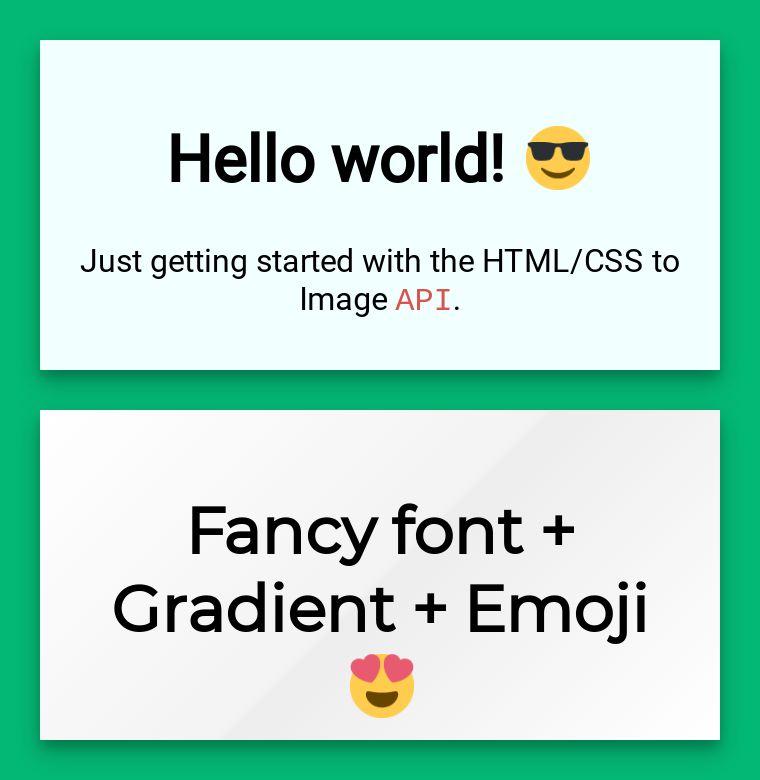

# Using Google Fonts

## How it works

The API automatically supports all [Google Fonts](https://fonts.google.com/). To use them, you must specify the fonts you would like loaded via the `google_fonts` parameter when creating your image.

To load a single font, set the parameter to the font name: `google_fonts=Roboto`. And then set the font family in your CSS: `font-family: 'Roboto';`. On render, the API will load the font and use it for creating your image.

Multiple fonts must be delimited by the `|` character: `google_fonts=Open Sans|Roboto|Montserrat`


### `Fonts and rendering speed`

A large number of custom fonts can slow down initial render time. Only include the fonts you use.  


## Example





```markup
<div class="box">
  <h1>Hello world! 😎 /h1>
  <p>Just getting started with the HTML/CSS to Image <code>API</code>.</p>
</div>
<div class="box fancy-font gradient">
  <h1>Fancy font + Gradient + Emoji 😍</h1>
</div>
```





```css
.box {
  width: 300px;
  border: 1px;
  box-shadow: 0 4px 8px 0 rgba(0, 0, 0, 0.2), 0 6px 20px 0 rgba(0, 0, 0, 0.19);
  font-family: 'Roboto';
  background-color: #F1FFFF;
  height: 125px;
  text-align: center;
  padding: 20px;
  margin: 20px;
}

.gradient{
  background: linear-gradient(135deg, #ffffff 0%,#f3f3f3 50%,#ededed 51%,#ffffff 100%);
}

.fancy-font {
  font-family: 'Montserrat';
}

h1 {
  padding: 0px;
}

p {
  padding: 0px;
}

code {
  font-family: "Courier New";
  color: #d9534f;
}

body {
  background-color: #03B874;
}
```



