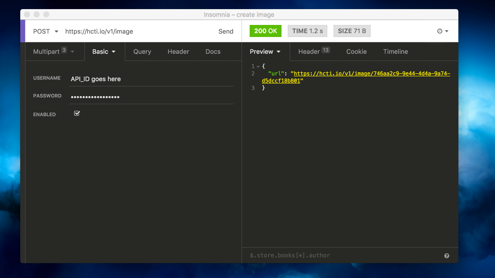
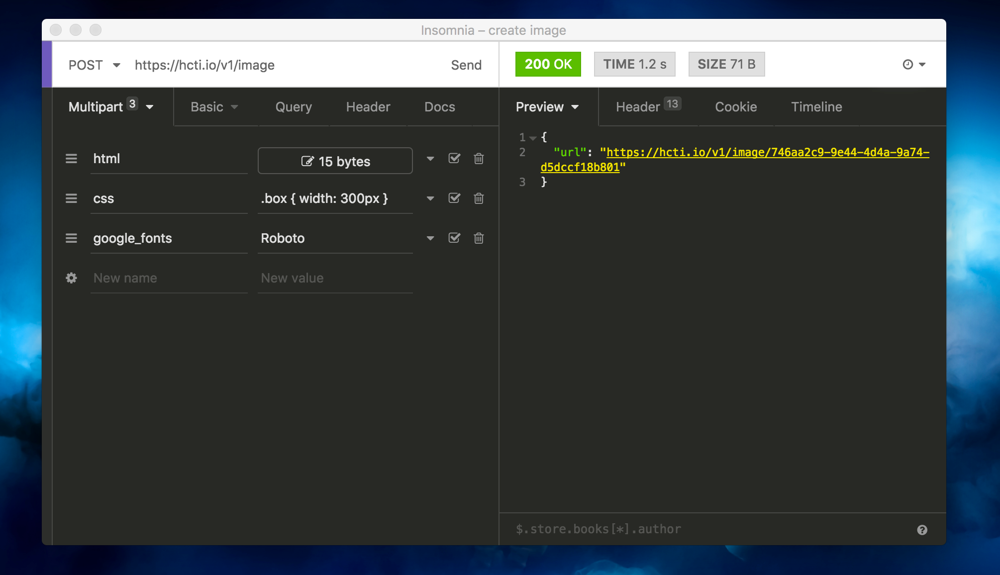

# Insomnia REST client

Download[ Insomnia here](https://insomnia.rest/) \(Mac OSX only\).

### Authorization

First, you'll want to set authorization to **Basic** and enter your API\_ID and API\_KEY from the [Dashboard](https://htmlcsstoimage.com/dashboard).

### Passing HTML/CSS

Then, enter your HTML/CSS as parameters for the request. For details on all the available parameters, visit: [Creating an image](../getting-started/creating-an-image.md).

