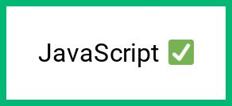

# JavaScript

This post will show you how to convert HTML/CSS to an image using JavaScript.

* [JavaScript Example](javascript.md#javascript-example)
* [JavaScript Example - async/await](javascript.md#javascript-example-async-await)
* [Plain JavaScript \(Node.js\) example](javascript.md#plain-javascript-nodejs-example)


Try it out yourself with the ****[**live demo**](https://htmlcsstoimage.com/#demo).

### JavaScript Example

To create an image, you need to send a POST request to the  `v1/image` endpoint. 

The API takes your HTML/CSS and runs it inside a real instance of Google Chrome to generate the image.

#### Parameters



**Data type:** String \(required\)

This is the HTML you want to render. You can send an HTML snippet \(`<div>Your content</div>`\) or an entire webpage.

**External JS and CSS are supported.** 

You can include script tags and &lt;link&gt; tags to CSS. Be sure that any assets you include are available via a full publicly accessible URL so that we can download them before rendering.



**Data type:** String \(optional\)

The CSS for your image.



**Data type:** String \(optional\)

Google Fonts to be loaded before rendering the image. To see all of the fonts available, visit: [https://fonts.google.com/](https://fonts.google.com/)

**Single font**

Pass the font name as the parameter.

`Roboto`

**Multiple fonts**

Separate multiple fonts with a `|`.

`Roboto|Roboto Condensed|Open Sans`

\*\*\*\*



If you'd like to try it out first without writing any code, take a look at the [demo](https://htmlcsstoimage.com/#demo).

This example uses the [Request client](https://github.com/request/request-promise). Install with `npm install request`.



```javascript
const request = require('request')

// Define your HTML/CSS
const data = {
  html: "<div class='box'>JavaScript ✅</div>",
  css: ".box { border: 4px solid #03B875; padding: 20px; font-family: 'Roboto'; }",
  google_fonts: "Roboto"
}

// Create an image by sending a POST to the API.
// Retrieve your api_id and api_key from the Dashboard. https://htmlcsstoimage.com/dashboard
request.post({ url: 'https://hcti.io/v1/image', form: data})
  .auth(API_ID, API_KEY)
  .on('data', function(data) {
    console.log(JSON.parse(data))
  })

// {"url": "https://hcti.io/v1/image/1113184e-419f-49f1-b231-2069942a186f"}
```





**Can I use this in a browser?**

No. We recommend only using the API server-side. This is important because it keeps your api keys secret. If you expose them in the browser, they can be used by anyone.


\*\*\*\*

### JavaScript Example - async/await

If your code supports async/await, we recommend using the following.

This example uses the [Request promise client](https://github.com/request/request-promise). Install with `npm install request-promise`.



```javascript
require('request')
const request = require('request-promise')

// Define your HTML/CSS
const data = {
  html: "<div class='box'>JavaScript ✅</div>",
  css: ".box { border: 4px solid #03B875; padding: 20px; font-family: 'Roboto'; }",
  google_fonts: "Roboto"
}

// Create an image by sending a POST to the API.
// Retrieve your api_id and api_key from the Dashboard. https://htmlcsstoimage.com/dashboard
const image = await request
  .post({ url: 'https://hcti.io/v1/image', form: data})
  .auth(API_ID, API_KEY)

const { url } = JSON.parse(image)

// {"url": "https://hcti.io/v1/image/1113184e-419f-49f1-b231-2069942a186f"}
```





### Plain JavaScript \(Node.js\) example

If you prefer not to install an HTTP library for making the request. This example shows you how to use the API without any.



```javascript
const https = require('https')

const data = JSON.stringify({
  html: "<div class='box'>JavaScript ✅</div>",
  css: ".box { border: 4px solid #03B875; padding: 20px; font-family: 'Roboto'; }",
  google_fonts: "Roboto"
})

// Retrieve your api_id and api_key from the Dashboard. https://htmlcsstoimage.com/dashboard
const apiId = "your-api-id"
const apiKey = "your-api-key"

const options = {
  hostname: 'hcti.io',
  port: 443,
  path: '/v1/image',
  method: 'POST',
  headers: {
    'Content-Type': 'application/json',
    'Authorization': 'Basic ' + new Buffer(apiId + ':' + apiKey).toString('base64')
  }
}

const req = https.request(options, (res) => {
  console.log(`statusCode: ${res.statusCode}`)

  res.on('data', (d) => {
    const image = JSON.parse(d)
    console.log(image["url"])
  })
})

req.on('error', (error) => {
  console.error(error)
})

req.write(data)
req.end()
```



### More examples

For more advanced examples, [take a look here](../#examples).

### Need help? 

Email us **support@htmlcsstoimage.com** 

Share with us what you're building. We're experts at generating images and love to help.

