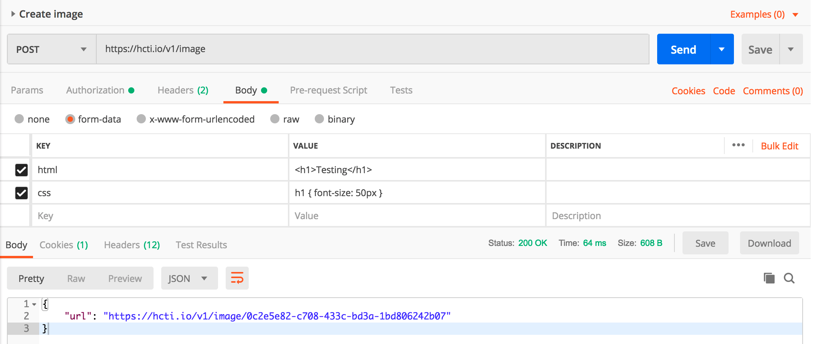

# Postman

Download Postman from [https://www.getpostman.com/](https://www.getpostman.com/).

### URL

For creating an image, create a new POST request to **https://hcti.io/v1/image**.

### Authorization

First, go to the Authorization tab, select "Basic Auth" and enter your User ID and API Key \(available from your [Dashboard](https://htmlcsstoimage.com/dashboard)\).

### Set HTML/CSS

Go to "Body" and click "form-data". Then enter your HTML/CSS.

### Done

Press **send** and you'll get back the URL to your generated image.

