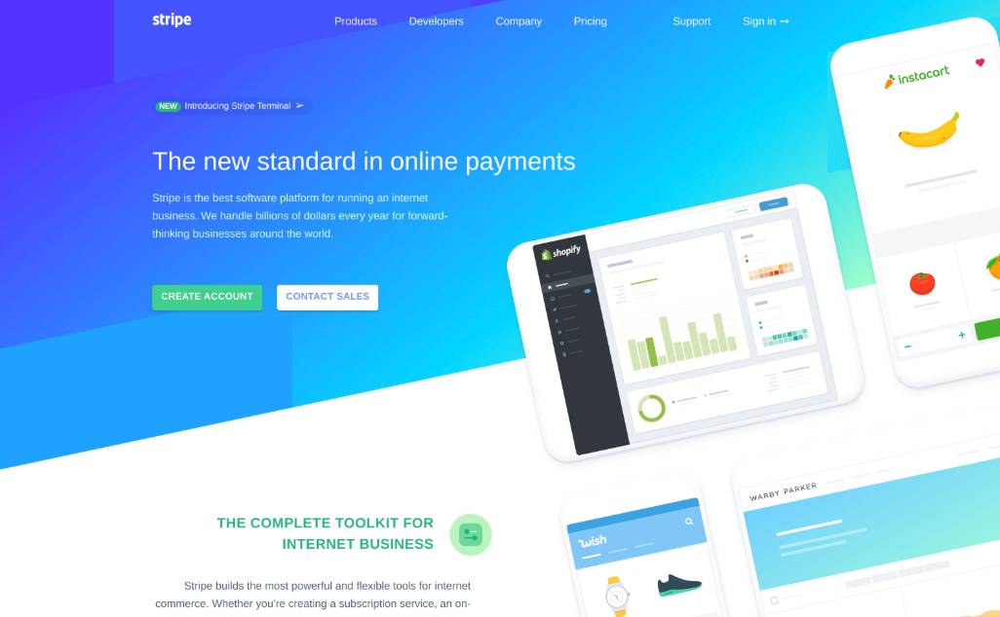

# Full page images

You have two options for generating screenshots of full webpages.

### 1. Use the URL param to screenshot a public URL

If you have a public URL, you can easily take a screenshot of any website using our [URL to image](url-to-image.md) endpoint.

Click the link below to see a full guide on how to do this.



### 2. Pass entire document to the API

If you don't have the website available as a URL, we have an alternative for you.

Set your `html` value to the full html of your webpage \(starting and ending with the `<html>` tags\). The API will enter full page mode and render the entire page as displayed by Google Chrome.

When rendering a full page, be sure to include full paths to all outside assets so that the API is able to download them. Relative paths will not work.

Here we passed the full HTML of Stripe's homepage.

