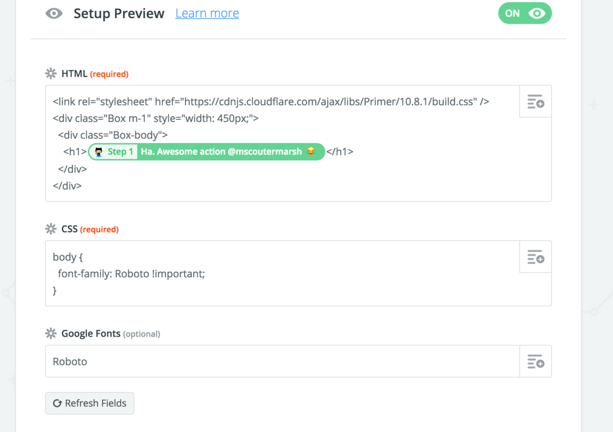

# Zapier Integration

Our [Zapier](https://zapier.com/apps/htmlcss-to-image/integrations) integration allows you to automate image generation without writing any code.

### **Add the integration to your account**

First, you'll need to add the integration to your account by [**clicking here**](https://zapier.com/apps/htmlcss-to-image/integrations).

### **Example uses**

You can automate tasks that were previously very tedious or time consuming by generating images with Zapier.

* Create an image when a new record is added to a Google Sheets or AirTable doc.
* Regularly take screenshots of a website and save to Google Drive.
* Dynamically change text within a generated image by using variables inside your HTML.
* Auto generate targeted advertisements and publish them.

### Use it in a Zap

Once it's added to your account, you will be able to use it by creating a new Zap, and searching for "HTML/CSS" when adding an action to your zap.


The Zapier integration is currently in beta. We're actively working on improving it. Please send any feedback to **support@htmlcsstoimage.com**.


