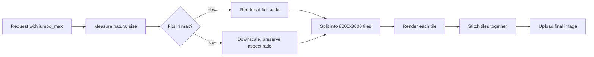

# Jumbo Images
{: .no_toc }
{: .fs-9 }

Render images larger than the standard ~8000px limit by splitting and stitching tiles.
{: .fs-6 .fw-300 }

<hr>

1. TOC
{:toc}

<hr>

## What are jumbo images?

Standard renders are capped at roughly **8000 pixels** on each side. That's a Chrome rendering limit, not an API one — once you cross it, the browser starts dropping content or refusing to paint.

Jumbo images get around this. When you set `jumbo_max_width` and `jumbo_max_height`, the API renders your output in **8000 x 8000 tiles** and stitches them back into a single image. This lets you generate images up to **80,000 pixels** on a side.

### Why jumbo matters

The big win is **quality**. Jumbo lets you produce huge images **without losing sharpness**:

- Your `device_scale` is preserved end-to-end. A `2x` retina render stays `2x` — even at 50,000 pixels wide.
- Each tile is rendered natively in Chrome at full resolution, then stitched. There's no resampling or post-render shrinking.
- Crisp text, vector edges, and 1px borders that would normally turn fuzzy on huge canvases stay clean.



### When to use it

- Long marketing pages, full-site captures, or scrollable dashboards.
- Print-resolution posters, signage, or banners.
- Wide infographics, timelines, charts, or data tables.
- Retina (`device_scale: 2` or `3`) renders of medium-sized pages where `width * device_scale` would already cross 8000px.
- Any HTML or URL screenshot where the natural output exceeds ~8000px.

Jumbo works with both `html`/`css` and `url` requests.

<hr>

## Parameters

| Parameter | Type | Description |
|:----------|:-----|:------------|
| `jumbo_max_width` | `Integer` | Maximum output width, in pixels. Range: `1` – `80000`. **Required** when `jumbo_max_height` is set. |
| `jumbo_max_height` | `Integer` | Maximum output height, in pixels. Range: `1` – `80000`. **Required** when `jumbo_max_width` is set. |

Both parameters must be set together. Setting one without the other returns a `400`.

These are **maximums**, not exact dimensions. If your content is smaller than the max, you get a smaller image. If it's larger, the renderer scales down to fit (see [How it works](#how-it-works)).

<hr>

## How it works

When you pass `jumbo_max_width` and `jumbo_max_height`, the renderer:

1. Measures the natural size of your page (or `selector` element) at the requested `device_scale`.
2. If that natural size fits inside `jumbo_max_width` x `jumbo_max_height`, it renders at full resolution.
3. If it doesn't fit, it picks the largest scale that **preserves the aspect ratio** and stays inside both maxes.
4. Splits the output into **8000 x 8000 tiles**.
5. Renders each tile separately in Chrome.
6. Stitches the tiles back into a single image and uploads the result.



The result is a single image — you don't need to do any stitching on your end.

<hr>

## Limits

| Rule | Limit |
|:-----|:------|
| Max value per dimension | `80,000` pixels |
| Min value per dimension | `1` pixel |
| At least one dimension must exceed | `8,000` pixels |
| Max total area (`width * height`) | `400,000,000` pixels |
| Both parameters must be set | Yes — sending one alone returns `400` |
| Compatible with `pdf_options` | No — jumbo is image-only |

The "at least one dimension must exceed 8,000" rule exists because anything smaller fits in a single tile and should use a normal render instead.

The 400-million-pixel area cap means you can't max out both dimensions at once. Some valid combinations at the limit:

- `80,000 x 5,000`
- `40,000 x 10,000`
- `20,000 x 20,000`
- `12,500 x 32,000`

<hr>

## Billing

Jumbo images consume **one render per tile**, deducted from your monthly quota.

The number of tiles is calculated from the **final output size** (after any aspect-ratio downscaling):

```
tiles = ceil(output_width / 8000) * ceil(output_height / 8000)
```

If you also use `ms_delay`, the standard delay cost is added on top of the tile count:

```
total_renders = tiles + ceil(ms_delay / 5000)   # when ms_delay > 0
```

### Examples

| Output size | `ms_delay` | Renders billed |
|:------------|:-----------|:---------------|
| `8,001 x 8,001` | 0 | 4 |
| `12,000 x 8,100` | 0 | 2 |
| `16,000 x 16,000` | 0 | 4 |
| `24,000 x 16,000` | 0 | 6 |
| `80,000 x 5,000` | 0 | 10 |
| `16,000 x 16,000` | `7000` | 6 (4 tiles + 2 delay) |



<hr>

## Examples

### HTML render

```json
{
  "html": "<div style='width:12000px;height:8100px;background:linear-gradient(45deg,#4f46e5,#ec4899);'></div>",
  "jumbo_max_width": 12000,
  "jumbo_max_height": 8100
}
```

### URL render

```json
{
  "url": "https://example.com/long-marketing-page",
  "jumbo_max_width": 2000,
  "jumbo_max_height": 30000,
  "full_screen": true
}
```

### Render a specific large element

Combine `selector` with jumbo to capture one giant element on a page.

```json
{
  "html": "<html>... lots of content ...<div id='poster' style='width:16000px;height:16000px;'>...</div></html>",
  "selector": "#poster",
  "jumbo_max_width": 16000,
  "jumbo_max_height": 16000
}
```

### cURL

```bash
curl -X POST https://hcti.io/v1/image \
  -u 'user-id:api-key' \
  -H 'Content-Type: application/json' \
  -d '{
        "url": "https://example.com",
        "jumbo_max_width": 12000,
        "jumbo_max_height": 8100,
        "full_screen": true
      }'
```

<hr>

## Troubleshooting

### `jumbo_max_width must be present when jumbo_max_height is specified.`

Both params are required together. Add the missing one.

### `jumbo_max_height or jumbo_max_width should be greater than 8000`

At least one dimension must be `> 8000`. If both are `<= 8000`, drop the jumbo params and use a normal render — it will be cheaper and faster.

### `total jumbo pixel area cannot be greater than 400,000,000.`

`jumbo_max_width * jumbo_max_height` exceeds the 400M area cap. Reduce one or both dimensions.

### `cannot set pdf_options and jumbo options together`

Jumbo is image-only (PNG / JPG / WebP). Remove `pdf_options` if you want a jumbo render.

### My image came back smaller than `jumbo_max_width` x `jumbo_max_height`

Those parameters are **maximums**. If your content is naturally smaller, the output will be smaller too. If your content is larger, the renderer downscales to fit while preserving aspect ratio — so the output matches one dimension exactly and is shorter on the other axis.

### My large image is blurry (and I'm not using jumbo)

When a render naturally exceeds ~8000px and `jumbo_max_width` / `jumbo_max_height` are not set, the API scales the image down to fit Chrome's limit. The result is a single-resolution image that no longer matches your `device_scale`, which usually looks blurry — especially text and thin lines.

Fix: set `jumbo_max_width` and `jumbo_max_height` to the size you actually want. The renderer will tile and stitch instead of downscaling, and your `device_scale` will be preserved.

### Why did this cost N renders?

See [Billing](#billing). The render count is `ceil(width / 8000) * ceil(height / 8000)` based on the **final output size**, plus any `ms_delay` cost. The dashboard usage view shows the per-image render count.


