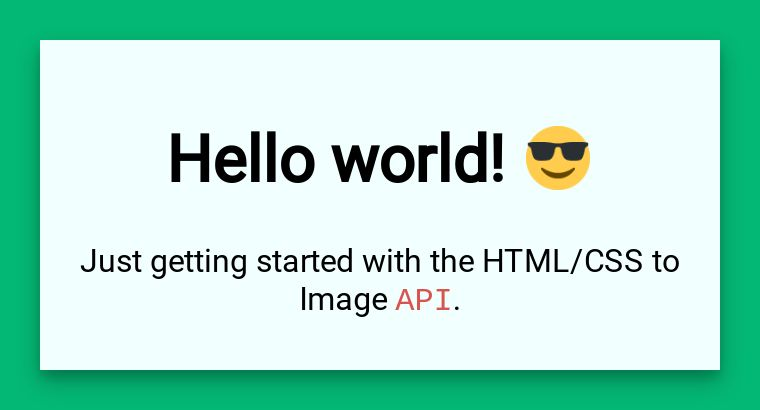

# Rendering Emoji
{: .no_toc }
{: .fs-9 }

Emoji rendering is built in and handled automatically for you.
{: .fs-6 .fw-300 }

## How it works
Emoji's are automatically replaced with images for consistent and clear rendering. This is enabled for you by default.



### emoji class

Each image has an `emoji`class added to it on render. This makes it easy to tweak their display. 

```css
/* Take advantage of the built in 'emoji' class to modify the display of emoji */
img.emoji {
  height: 2em;
  width: 2em;
  margin: 0 .05em 0 .1em;
}
```
